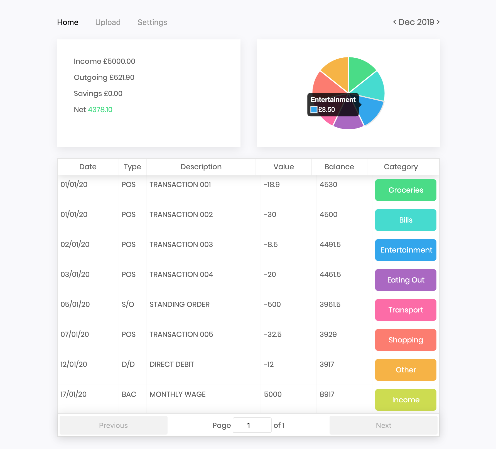

# Money Manager 💵
Third version of a simple money management offline web app. Gain simple insights into your spending.

money manager was created as a learning project focused on using React, Electron and SQLite to create a cross platform offline application.

## Build it
`yarn build`

## Start it
`yarn start`

## Release it
`yarn release`

## Train it
`yarn make:train` to make and train a new classifier based on a simple data set.